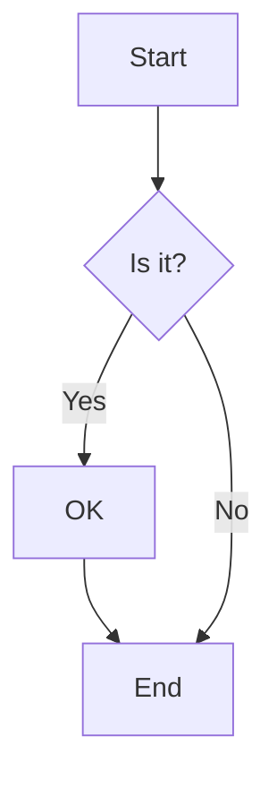

# Examples

Explore real-world examples and demos showcasing Leaf's features.

## Live Demos

### Basic Documentation Site

A minimal documentation site demonstrating core features:

- Auto-generated sidebar
- Dark mode toggle
- Search functionality
- Responsive layout

::: tip Coming Soon
Example repositories are being prepared. Check back soon!
:::

### API Documentation

Full API reference site with:

- Multi-level navigation
- Code examples with syntax highlighting
- Math equations
- Mermaid diagrams

::: tip Coming Soon
Example repositories are being prepared. Check back soon!
:::

### Component Library Docs

Documentation for a React component library featuring:

- Live component previews
- Props tables
- Usage examples
- Custom theme

::: tip Coming Soon
Example repositories are being prepared. Check back soon!
:::

## Code Examples

### Custom Container

```markdown
::: tip Pro Tip
Use custom containers to highlight important information!
:::

::: warning Watch Out
Always validate user input.
:::

::: danger Danger Zone
This operation cannot be undone.
:::
```

### Code Groups

````markdown
::: code-group

```typescript [TypeScript]
const greeting: string = "Hello, Leaf!";
console.log(greeting);
```

```javascript [JavaScript]
const greeting = "Hello, Leaf!";
console.log(greeting);
```

:::
````

### Math Equations

Inline math: $E = mc^2$

Block math:

$$
\int_{-\infty}^{\infty} e^{-x^2} dx = \sqrt{\pi}
$$

### Mermaid Diagrams



## Templates

### Starter Template

Clone the official starter template:

```bash
bunx degit sylphxltd/leaf/examples/starter my-docs
cd my-docs
bun install
bun run dev
```

### Blog Template

Documentation site with blog features:

```bash
bunx degit sylphxltd/leaf/examples/blog my-blog
cd my-blog
bun install
bun run dev
```

## Contributing Examples

Have an example to share? We'd love to feature it!

1. Fork the repository
2. Add your example to `examples/`
3. Update this page
4. Submit a pull request

See the [contributing guide](https://github.com/sylphxltd/leaf/blob/main/CONTRIBUTING.md) for details.
