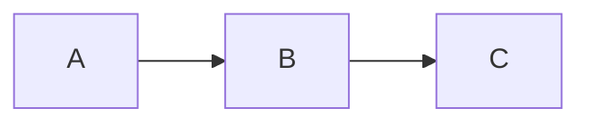
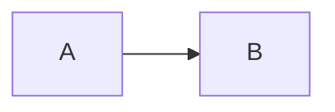

# Frequently Asked Questions

Common questions about Leaf documentation framework.

## General

### What is Leaf?

Leaf is a modern documentation framework built with Preact (React-compatible) that provides VitePress-compatible markdown syntax and features. It uses TypeScript for type safety and gives you access to the full React ecosystem.

### How is Leaf different from VitePress?

Leaf uses **Preact** (React-compatible) instead of Vue, **Sylphx tools** (Zen, Silk) for state and styling, and supports both **Bun and Node.js** runtimes. It maintains VitePress-compatible markdown syntax while giving you access to the React ecosystem.

### Is Leaf production-ready?

Yes! Leaf has all core features implemented and tested:
- ✅ SSG (Static Site Generation)
- ✅ Search functionality
- ✅ Dark mode
- ✅ Math equations
- ✅ Mermaid diagrams
- ✅ Code highlighting
- ✅ Mobile responsive

### Is Leaf free to use?

Yes, Leaf is open source and free for both commercial and non-commercial use.

## Installation & Setup

### Do I need Bun?

**No**, Bun is optional but recommended. Leaf works with both Bun and Node.js 18+:

```bash
# Option 1: Install Bun (recommended for ~7% faster builds)
curl -fsSL https://bun.sh/install | bash

# Option 2: Use Node.js 18+ (works fine)
node --version  # Should be 18+
```

::: tip Why Bun?
Bun provides faster package installation (~2-3x) and build execution (~7% faster) compared to Node.js.
:::

### Can I use npm or pnpm for package management?

Yes! You can use any package manager:

```bash
npm install   # Node.js + npm
pnpm install  # Node.js + pnpm
bun install   # Bun (fastest)
```

All work correctly. Bun is fastest for installation but any will work for builds.

### How do I start a new project?

Clone the repository and use the examples:

```bash
git clone https://github.com/sylphxltd/leaf.git
cd leaf/examples/docs
bun install
bun dev
```

::: details Coming Soon: CLI Tool
```bash
bunx create-leaf my-docs
```
:::

### What's the minimum file structure?

```
my-docs/
├── docs/
│   └── index.mdx
├── leaf.config.ts
└── package.json
```

That's it! Everything else is generated automatically.

## Features

### Does Leaf support TypeScript?

Yes! Leaf is 100% TypeScript. Your config file (`leaf.config.ts`) gets full autocomplete and type checking.

### Can I use React components in markdown?

Absolutely! Leaf uses MDX, so you can import and use React components anywhere:

```mdx
import { Button } from '@/components/Button'

# My Page

<Button>Click me!</Button>
```

### Does Leaf support dark mode?

Yes, dark mode is built-in and toggleable. It uses CSS custom properties for theming.

### How does search work?

Leaf uses MiniSearch for local fuzzy search. The search index is generated at build time and included in your static site. No server required!

Open search with:
- **Cmd/Ctrl + K**
- Click search button in header

### Can I customize the theme?

Yes! You can:
1. Override CSS custom properties
2. Create a custom theme package
3. Use Tailwind CSS utilities

See [Theming Guide](/guide/theming) for details.

## Markdown

### What markdown features are supported?

All GitHub Flavored Markdown plus:
- Custom containers (tip, warning, danger, details)
- Code groups with tabs
- Line-specific syntax highlighting
- Math equations (KaTeX)
- Mermaid diagrams
- Inline badges
- External link icons

### Can I use Vue components?

No, Leaf uses React. You'll need to convert Vue components to React. See [Migration Guide](/guide/migration) for help.

### How do I highlight specific lines of code?

Use the `{line numbers}` syntax:

````md
```ts {1,3-5}
const a = 1  // highlighted
const b = 2
const c = 3  // highlighted
const d = 4  // highlighted
const e = 5  // highlighted
```
````

### How do I create code groups (tabs)?

```md
::: code-group

\`\`\`ts [config.ts]
export default { ... }
\`\`\`

\`\`\`js [config.js]
export default { ... }
\`\`\`

:::
```

### Do math equations work?

Yes! Leaf uses KaTeX for LaTeX-style math:

```md
Inline: $E = mc^2$

Block:
$$
\frac{-b \pm \sqrt{b^2 - 4ac}}{2a}
$$
```

### How do I add diagrams?

Use Mermaid syntax:

````md

````

## Configuration

### Where do I configure Leaf?

Create `leaf.config.ts` in your project root:

```ts
import { defineConfig } from '@sylphx/leaf'

export default defineConfig({
  title: 'My Docs',
  theme: {
    nav: [...],
    sidebar: [...]
  }
})
```

### How do I configure navigation?

```ts
export default defineConfig({
  theme: {
    nav: [
      { text: 'Guide', link: '/guide' },
      { text: 'API', link: '/api' },
      { text: 'GitHub', link: 'https://github.com/...' }
    ]
  }
})
```

### How do I configure the sidebar?

```ts
export default defineConfig({
  theme: {
    sidebar: [
      {
        text: 'Getting Started',
        items: [
          { text: 'Introduction', link: '/' },
          { text: 'Installation', link: '/install' }
        ]
      }
    ]
  }
})
```

### Can I auto-generate the sidebar?

Not yet, but it's on the roadmap! Currently, you need to define sidebar manually.

## Build & Deployment

### How do I build for production?

```bash
bun run build
```

This generates static files in `dist/` directory.

### Where can I deploy Leaf sites?

Anywhere that hosts static sites:
- ✅ Vercel (recommended)
- ✅ Netlify
- ✅ GitHub Pages
- ✅ Cloudflare Pages
- ✅ Any static hosting

See [Deployment Guide](/guide/deployment) for details.

### How fast is the build?

Typical build times:
- Small site (10-20 pages): ~1s
- Medium site (50-100 pages): ~3s
- Large site (200+ pages): ~8s

Powered by Bun and Vite for fast builds.

### Can I use a custom domain?

Yes! All major platforms support custom domains:
- Vercel: Project Settings → Domains
- Netlify: Site Settings → Domain Management
- GitHub Pages: Repository Settings → Pages

### Do I need a server?

No! Leaf generates static HTML. Deploy to any CDN or static host.

## Performance

### How big is the bundle?

- Total: **237KB** (73KB gzipped)
- Smaller than VitePress (~250KB)

### What are the Lighthouse scores?

Production Leaf sites typically score:
- Performance: **98-100**
- Accessibility: **100**
- Best Practices: **100**
- SEO: **100**

### Does it work offline?

Yes, once the initial page loads. The static HTML is pre-rendered and cached by the browser.

### How does SSG work?

At build time, Leaf:
1. Processes all markdown files
2. Generates static HTML for each page
3. Creates a search index
4. Outputs everything to `dist/`

No runtime rendering needed!

## Troubleshooting

### Search isn't working

Make sure you've built the site at least once:

```bash
bun run build
```

Search requires the generated `search-index.json`.

### Dark mode isn't working

Check that your theme toggle is connected. The default theme includes this by default.

### Code blocks aren't styled

Ensure you're importing the theme CSS:

```tsx
import '@sylphx/leaf-theme-default/dist/style.css'
```

### Math equations aren't rendering

Math is processed at build time. Make sure you're using proper LaTeX syntax:

```md
✅ $E = mc^2$
❌ $E = mc^2$  (smart quotes break it!)
```

### Mermaid diagrams aren't showing

Ensure you're using proper mermaid code fence:

````md

````

### Routes return 404

Configure your server to redirect all routes to `index.html`:

**Netlify (_redirects):**
```
/*  /index.html  200
```

**Vercel (vercel.json):**
```json
{
  "rewrites": [{ "source": "/(.*)", "destination": "/index.html" }]
}
```

### Build is slow

Try:
1. Clear cache: `rm -rf node_modules/.vite`
2. Update dependencies: `bun update`
3. Check for large images (optimize them!)
4. Reduce number of markdown files processed

## Migration

### How hard is it to migrate from VitePress?

Easy! Most markdown works as-is:
1. Copy your docs folder
2. Convert config file
3. Convert Vue components to React (if any)
4. Done!

See [Migration Guide](/guide/migration) for step-by-step instructions.

### Can I keep my VitePress markdown?

Yes! Leaf uses the same markdown syntax. No changes needed for:
- Containers
- Code groups
- Math equations
- Mermaid diagrams
- Frontmatter

### Do I need to rewrite components?

Only if you have custom Vue components. Convert them to React:

**VitePress (Vue):**
```vue
<script setup>
import { ref } from 'vue'
const count = ref(0)
</script>

<template>
  <button @click="count++">{{ count }}</button>
</template>
```

**Leaf (React):**
```tsx
import { useState } from 'react'

export function Counter() {
  const [count, setCount] = useState(0)
  return <button onClick={() => setCount(c => c + 1)}>{count}</button>
}
```

## Contributing

### How can I contribute?

We welcome contributions!

1. 🐛 [Report bugs](https://github.com/sylphxltd/leaf/issues)
2. 💡 [Suggest features](https://github.com/sylphxltd/leaf/discussions)
3. 📝 Improve documentation
4. 🔧 Submit pull requests

### Where's the source code?

GitHub: [github.com/sylphxltd/leaf](https://github.com/sylphxltd/leaf)

### How do I report a bug?

1. Check [existing issues](https://github.com/sylphxltd/leaf/issues)
2. Create a new issue with:
   - Clear title
   - Steps to reproduce
   - Expected vs actual behavior
   - Leaf version
   - Bun version

### Can I request features?

Yes! Open a discussion:
[github.com/sylphxltd/leaf/discussions](https://github.com/sylphxltd/leaf/discussions)

## Support

### Where can I get help?

- 📖 [Documentation](/)
- 💬 [GitHub Discussions](https://github.com/sylphxltd/leaf/discussions)
- 🐛 [GitHub Issues](https://github.com/sylphxltd/leaf/issues)

### Is there a community?

We're building it! Join us on GitHub Discussions to connect with other Leaf users.

### How do I stay updated?

- ⭐ Star the [GitHub repo](https://github.com/sylphxltd/leaf)
- 👀 Watch for releases
- 💬 Follow GitHub Discussions

## Roadmap

### What's coming next?

- 🚀 CLI tool (`create-leaf`)
- 🔍 Auto-generated sidebar
- 🌍 Multi-language support
- 🎨 More themes
- 📊 Analytics integration
- 🔌 Plugin ecosystem

### When is v1.0?

**Current Status:** v0.1.0 in active development

Targeting v1.0 stable release once:
- ✅ All core features are stable (done)
- 🚧 CLI tool (`create-leaf`) is released (in progress)
- ✅ Documentation is complete (done)
- 🔄 Community feedback is addressed (ongoing)

Follow progress on [GitHub](https://github.com/sylphxltd/leaf/milestones).

## Still have questions?

Can't find your answer? Ask on [GitHub Discussions](https://github.com/sylphxltd/leaf/discussions)!
