# Mermaid Diagrams

Leaf supports [Mermaid](https://mermaid.js.org/), a powerful diagramming and charting tool that uses text-based syntax.

## Flowcharts

Create flowcharts to visualize processes and workflows:

````markdown
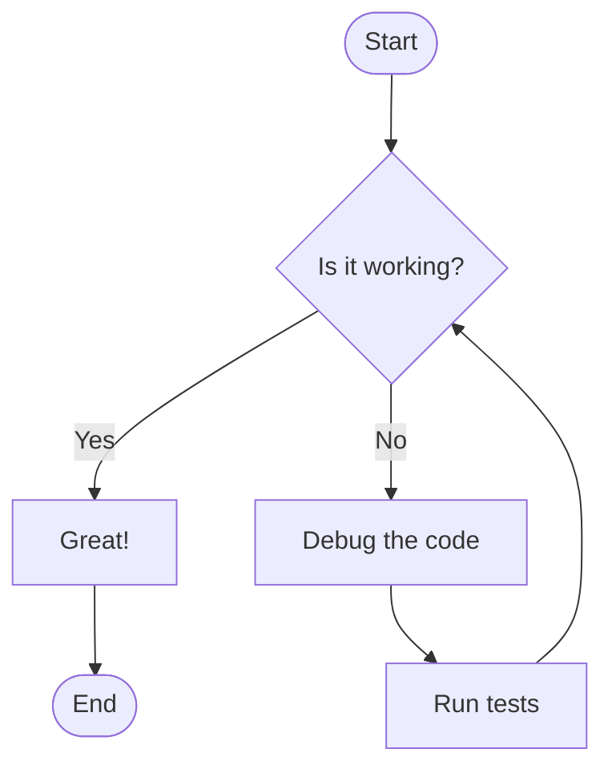
````

**Result:**


### Flowchart Directions

- `TD` or `TB` - Top to bottom
- `BT` - Bottom to top
- `LR` - Left to right
- `RL` - Right to left

## Sequence Diagrams

Show interactions between different actors:

````markdown
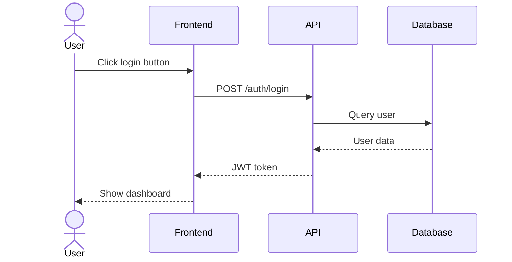
````

**Result:**


## Class Diagrams

Model object-oriented systems:

````markdown
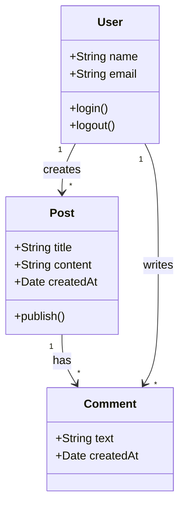
````

**Result:**


## State Diagrams

Represent state machines:

````markdown
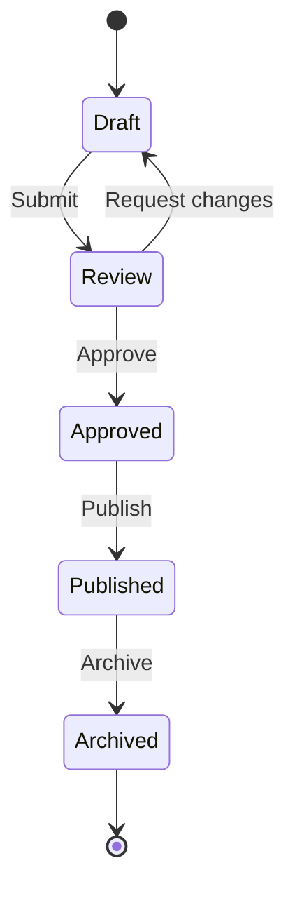
````

**Result:**


## Entity Relationship Diagrams

Model database relationships:

````markdown
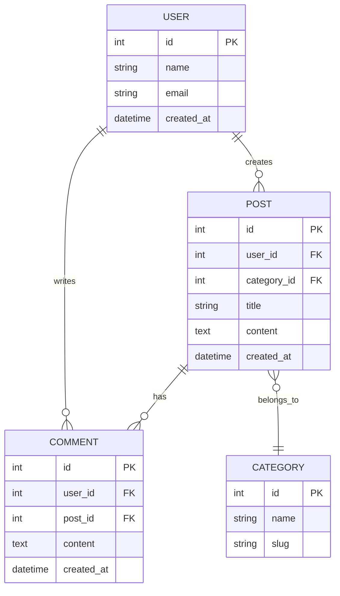
````

**Result:**


## Gantt Charts

Plan and track project timelines:

````markdown
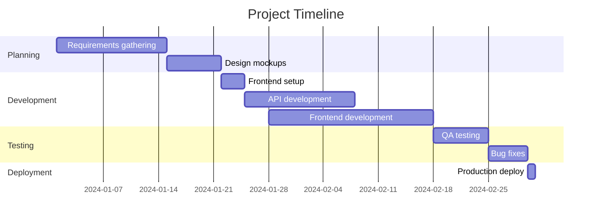
````

**Result:**


## Pie Charts

Show data distributions:

````markdown
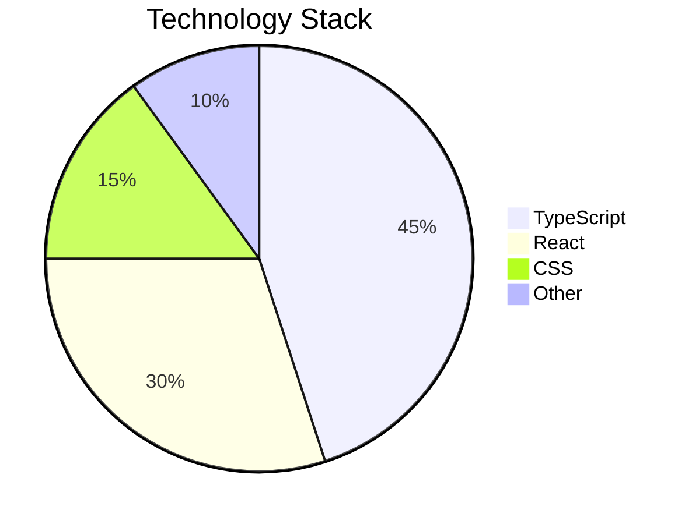
````

**Result:**


## Git Graphs

Visualize Git workflows:

````markdown
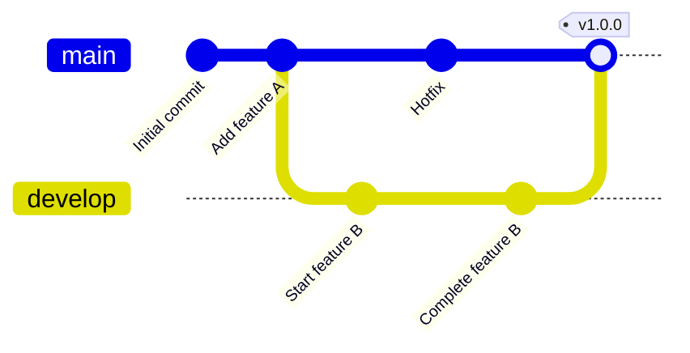
````

**Result:**


## Mindmaps

Organize ideas and concepts:

````markdown
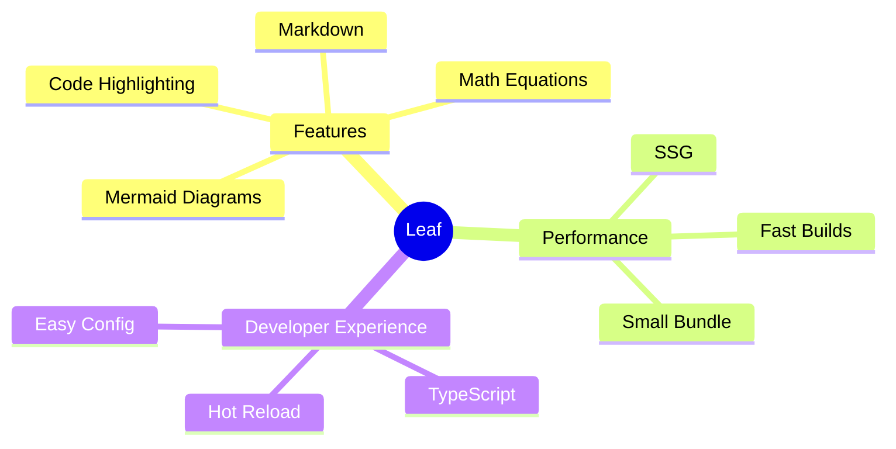
````

## Journey Diagrams

Map user experiences:

````markdown
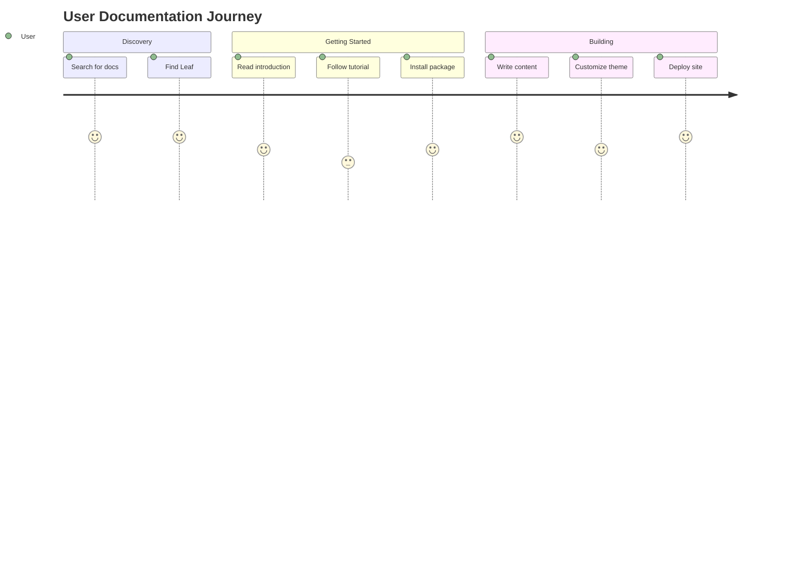
````

## Styling

Mermaid automatically adapts to your site's theme:

- **Light mode** - Clean, professional colors
- **Dark mode** - Vibrant, high-contrast colors

## Configuration

Mermaid support is enabled by default. To customize:

```typescript
import { defineConfig } from "@sylphx/leaf";

export default defineConfig({
  markdown: {
    mermaid: {
      theme: "default",  // or "dark", "forest", "neutral"
      startOnLoad: true
    }
  }
});
```

## Performance

Mermaid diagrams are optimized for performance:

- **Lazy loading** - Only loads when diagrams are present
- **CDN delivery** - Fast, cached distribution
- **Lightweight** - ~200KB for the library
- **No build-time rendering** - Renders client-side

## Best Practices

1. **Keep diagrams simple** - Complex diagrams are hard to read
2. **Use meaningful names** - Clear labels improve understanding
3. **Add titles** - Context helps interpretation
4. **Consider mobile** - Some diagrams don't fit small screens
5. **Use color sparingly** - Too much color is distracting

## Common Patterns

### Architecture Diagram

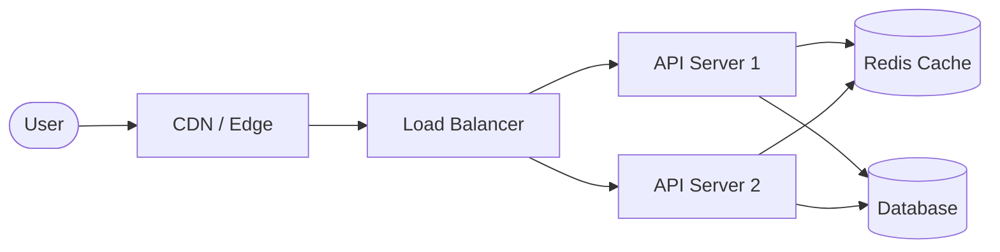

### State Machine

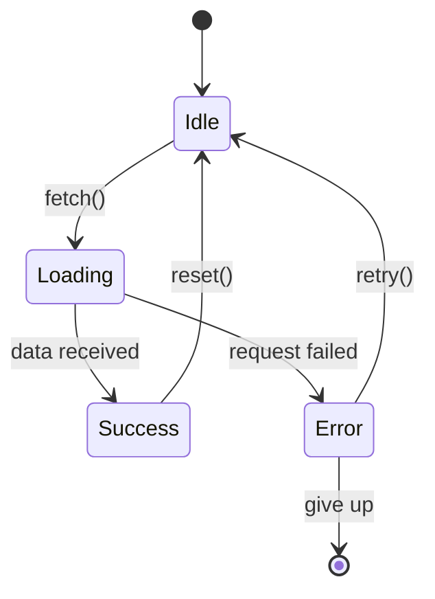

### API Flow

```mermaid
sequenceDiagram
    Client->>+API: GET /api/users
    API->>+Auth: Verify token
    Auth-->>-API: Token valid
    API->>+Cache: Check cache
    Cache-->>-API: Cache miss
    API->>+DB: Query users
    DB-->>-API: User data
    API->>+Cache: Store in cache
    Cache-->>-API: Cached
    API-->>-Client: 200 OK + data
```

## Troubleshooting

### Diagram not rendering

1. Check syntax - Mermaid is sensitive to syntax errors
2. Ensure language is `mermaid` (not `mer` or `mmd`)
3. Check browser console for errors

### Diagram cut off

Adjust the diagram width in your CSS:

```css
.mermaid {
  max-width: 100%;
  overflow-x: auto;
}
```

### Arrows not connecting

Ensure proper node IDs and arrow syntax:

```mermaid
<!-- ❌ Wrong -->
A -> B

<!-- ✅ Correct -->
A --> B
```

## Resources

- [Mermaid Documentation](https://mermaid.js.org/)
- [Live Editor](https://mermaid.live/)
- [Examples](https://mermaid.js.org/ecosystem/integrations.html)

## Next Steps

- [Learn about Math Equations](/features/math)
- [Full Markdown guide](/guide/markdown)
- [API reference](/api/markdown-plugins)
