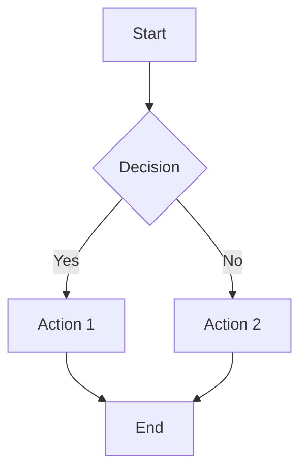
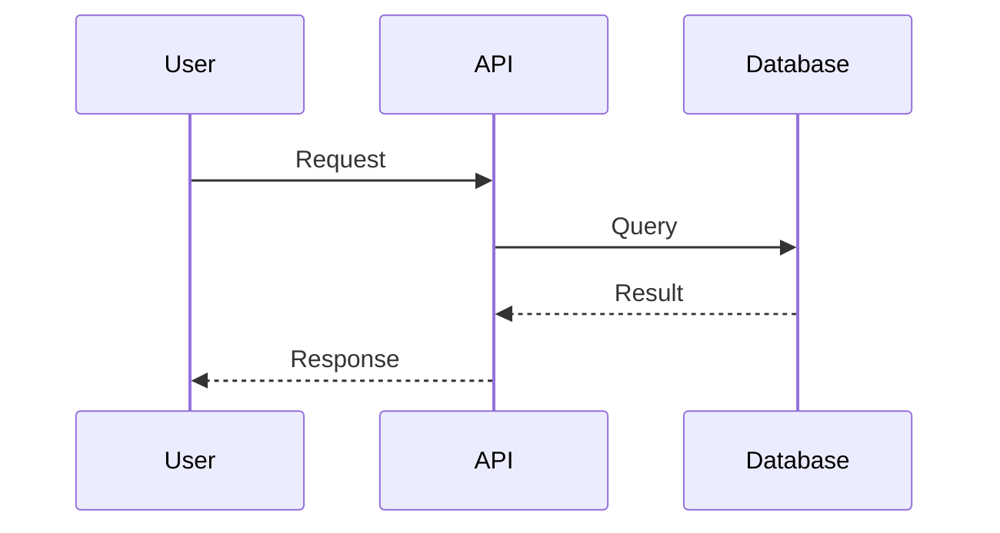
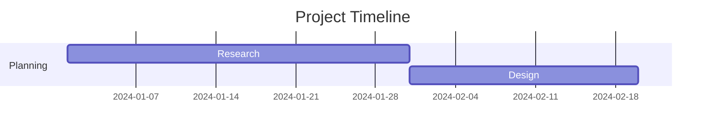

# Markdown Features

Leaf supports all standard Markdown syntax plus powerful extensions.

## Basic Syntax

### Headings

```markdown
# H1 Heading
## H2 Heading
### H3 Heading
```

### Text Formatting

**Bold text** with `**bold**` or `__bold__`

*Italic text* with `*italic*` or `_italic_`

~~Strikethrough~~ with `~~strikethrough~~`

### Lists

**Unordered:**
- Item 1
- Item 2
  - Nested item

**Ordered:**
1. First
2. Second
3. Third

### Links

[Internal link](/getting-started)

[External link](https://github.com) - automatically gets an icon!

### Images

```markdown

```

## Code Blocks

### Basic Code Block

\`\`\`typescript
function greet(name: string) {
  console.log(`Hello, ${name}!`);
}
\`\`\`

### Line Highlighting

Highlight specific lines with `{line-numbers}`:

\`\`\`typescript {2,4-6}
import { zen } from '@sylphx/zen';

const store = zen({ count: 0 });

function increment() {
  store.set({ count: store.get().count + 1 });
  console.log('Updated!');
}
\`\`\`

### Code Groups

Show multiple language examples with tabs:

::: code-group

\`\`\`ts [config.ts]
export default {
  title: 'My Docs',
  description: 'Documentation'
}
\`\`\`

\`\`\`js [config.js]
module.exports = {
  title: 'My Docs',
  description: 'Documentation'
}
\`\`\`

\`\`\`json [config.json]
{
  "title": "My Docs",
  "description": "Documentation"
}
\`\`\`

:::

## Custom Containers

### Tip

::: tip
This is a helpful tip for your readers!
:::

### Warning

::: warning
Be careful with this operation!
:::

### Danger

::: danger STOP
This is a critical warning about destructive actions!
:::

### Details

::: details Click to expand
Hidden content that readers can expand when needed.

You can include any markdown:
- Lists
- **Bold text**
- \`Code\`
:::

## Badges

Highlight important information with inline badges:

- New feature <Badge type="tip" text="NEW" />
- Beta status <Badge type="warning" text="BETA" />
- Deprecated <Badge type="danger" text="DEPRECATED" />
- Version <Badge type="info" text="v2.0+" />

Syntax:

```markdown
<Badge type="tip" text="NEW" />
<Badge type="warning" text="BETA" />
<Badge type="danger" text="DEPRECATED" />
<Badge type="info" text="v2.0+" />
```

## Math Equations

### Inline Math

When $a \ne 0$, there are two solutions to $ax^2 + bx + c = 0$.

```markdown
When $a \ne 0$, there are two solutions to $ax^2 + bx + c = 0$.
```

### Block Equations

$$
x = \frac{-b \pm \sqrt{b^2 - 4ac}}{2a}
$$

```markdown
$$
x = \frac{-b \pm \sqrt{b^2 - 4ac}}{2a}
$$
```

### Complex Formulas

$$
\begin{aligned}
\nabla \cdot \mathbf{E} &= \frac{\rho}{\epsilon_0} \\
\nabla \times \mathbf{B} &= \mu_0\mathbf{J} + \mu_0\epsilon_0\frac{\partial \mathbf{E}}{\partial t}
\end{aligned}
$$

## Mermaid Diagrams

### Flowchart

\`\`\`mermaid
graph TD
    A[Start] --> B{Decision}
    B -->|Yes| C[Action 1]
    B -->|No| D[Action 2]
    C --> E[End]
    D --> E
\`\`\`



### Sequence Diagram

\`\`\`mermaid
sequenceDiagram
    User->>API: Request
    API->>Database: Query
    Database-->>API: Result
    API-->>User: Response
\`\`\`



### Gantt Chart

\`\`\`mermaid
gantt
    title Project Timeline
    dateFormat YYYY-MM-DD
    section Planning
    Research :a1, 2024-01-01, 30d
    Design :a2, after a1, 20d
\`\`\`



## Tables

| Feature | Leaf | VitePress |
|---------|-----------|-----------|
| Runtime | Bun | Node.js |
| Speed | ⚡⚡⚡ | ⚡⚡ |
| Markdown | ✅ | ✅ |

```markdown
| Column 1 | Column 2 |
|----------|----------|
| Value 1  | Value 2  |
```

## Blockquotes

> This is a blockquote.
> It can span multiple lines.

```markdown
> This is a blockquote
```

## Horizontal Rule

---

```markdown
---
```

## Frontmatter

Add metadata to your pages:

```yaml
---
title: Page Title
order: 1
description: Page description
---
```

## Next Steps

- Learn about [Configuration](/guide/configuration)
- Explore [Code Highlighting](/features/code-highlighting)
- See [Math Equations](/features/math)
