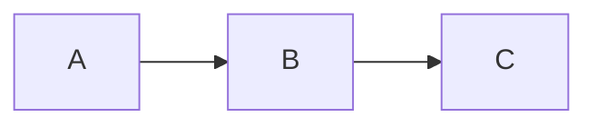

# Migrating from VitePress

Migrate your VitePress documentation to Leaf with minimal effort. Leaf maintains **VitePress markdown syntax compatibility**, so most content works as-is.

## Why Migrate?

- ⚛️ **React Ecosystem** - Access to React components and libraries
- ⚡ **Bun / Node.js** - Use Bun for faster builds or Node.js 18+
- 🎨 **Modern Tooling** - TypeScript-first development
- 📦 **Small Bundle** - 7KB framework overhead (Preact + Zen + Silk)
- 🔥 **VitePress-Compatible** - Same markdown syntax and features

## Quick Comparison

| Aspect | VitePress | Leaf |
|--------|-----------|------|
| Markdown Syntax | ✅ | ✅ Same |
| Containers | `:::` | `:::` Same |
| Code Groups | `:::code-group` | `:::code-group` Same |
| Math | KaTeX | KaTeX Same |
| Mermaid | Native | Client-side |
| Frontmatter | YAML | YAML Same |

## Migration Steps

### 1. Install Leaf

```bash
# Install Bun (if not installed)
curl -fsSL https://bun.sh/install | bash

# Create new Leaf project
git clone https://github.com/sylphxltd/leaf.git
cd leaf/examples/docs
bun install
```

### 2. Copy Content

Copy your markdown files from VitePress to Leaf:

```bash
# Copy docs folder
cp -r /path/to/vitepress/docs ./docs

# Keep your existing structure
# VitePress: docs/guide/getting-started.md
# Leaf:     docs/guide/getting-started.md ✅
```

::: tip Markdown Compatibility
All VitePress markdown features work in Leaf without modification:
- Containers (tip, warning, danger, details)
- Code groups with syntax highlighting
- Math equations with KaTeX
- Custom frontmatter
:::

### 3. Migrate Configuration

**VitePress config.ts:**

```ts
// .vitepress/config.ts
import { defineConfig } from 'vitepress'

export default defineConfig({
  title: 'My Docs',
  description: 'Documentation site',
  themeConfig: {
    nav: [
      { text: 'Guide', link: '/guide/' },
      { text: 'API', link: '/api/' }
    ],
    sidebar: {
      '/guide/': [
        {
          text: 'Introduction',
          items: [
            { text: 'Getting Started', link: '/guide/getting-started' }
          ]
        }
      ]
    }
  }
})
```

**Leaf config.ts:**

```ts
// leaf.config.ts
import { defineConfig } from '@sylphx/leaf'

export default defineConfig({
  title: 'My Docs',
  description: 'Documentation site',
  theme: {
    nav: [
      { text: 'Guide', link: '/guide' },
      { text: 'API', link: '/api' }
    ],
    sidebar: [
      {
        text: 'Introduction',
        items: [
          { text: 'Getting Started', link: '/guide/getting-started' }
        ]
      }
    ]
  }
})
```

**Key Differences:**

| Config | VitePress | Leaf |
|--------|-----------|------|
| Import | `vitepress` | `@sylphx/leaf` |
| Theme config | `themeConfig` | `theme` |
| Sidebar | Object with paths | Flat array |

### 4. Update Package.json

**VitePress:**

```json
{
  "scripts": {
    "dev": "vitepress dev docs",
    "build": "vitepress build docs",
    "preview": "vitepress preview docs"
  },
  "devDependencies": {
    "vitepress": "^1.0.0"
  }
}
```

**Leaf:**

```json
{
  "scripts": {
    "dev": "leaf dev",
    "build": "leaf build",
    "preview": "leaf preview"
  },
  "dependencies": {
    "@sylphx/leaf": "^0.1.0"
  }
}
```

### 5. Convert Custom Components

VitePress components (Vue) need to be rewritten in React:

**VitePress (Vue):**

```vue
<!-- .vitepress/components/Counter.vue -->
<script setup>
import { ref } from 'vue'
const count = ref(0)
</script>

<template>
  <button @click="count++">
    Count: {{ count }}
  </button>
</template>
```

**Leaf (React):**

```tsx
// components/Counter.tsx
import { useState } from 'react'

export function Counter() {
  const [count, setCount] = useState(0)

  return (
    <button onClick={() => setCount(c => c + 1)}>
      Count: {count}
    </button>
  )
}
```

### 6. Update Imports in Markdown

**VitePress:**

```md
<script setup>
import Counter from '../components/Counter.vue'
</script>

# My Page

<Counter />
```

**Leaf (MDX):**

```mdx
import { Counter } from '../components/Counter'

# My Page

<Counter />
```

## Feature Mapping

### Containers

✅ **Works identically:**

```md
::: tip
This is a tip
:::

::: warning
This is a warning
:::

::: danger
This is dangerous
:::

::: details Click to expand
Hidden content
:::
```

### Code Groups

✅ **Works identically:**

```md
::: code-group

\`\`\`ts [config.ts]
export default { ... }
\`\`\`

\`\`\`js [config.js]
export default { ... }
\`\`\`

:::
```

### Code Line Highlighting

✅ **Works identically:**

````md
```ts {1,3-5}
const a = 1  // highlighted
const b = 2
const c = 3  // highlighted
const d = 4  // highlighted
const e = 5  // highlighted
```
````

### Badges

✅ **Works identically:**

```md
# Title <Badge type="tip" text="NEW" />
# Feature <Badge type="warning" text="BETA" />
# Old API <Badge type="danger" text="DEPRECATED" />
```

### Math Equations

✅ **Works identically:**

```md
Inline: $E = mc^2$

Block:
$$
\frac{-b \pm \sqrt{b^2 - 4ac}}{2a}
$$
```

### Mermaid Diagrams

✅ **Works identically:**

````md

````

### Frontmatter

✅ **Works identically:**

```md
---
title: My Page
description: Page description
---

# Content here
```

## Breaking Changes

### 1. Sidebar Configuration

**VitePress** uses object with path keys:

```ts
sidebar: {
  '/guide/': [{ ... }],
  '/api/': [{ ... }]
}
```

**Leaf** uses flat array (auto-matches by link):

```ts
sidebar: [
  { text: 'Guide', items: [{ link: '/guide/...' }] },
  { text: 'API', items: [{ link: '/api/...' }] }
]
```

### 2. Theme Customization

**VitePress** uses CSS variables in `.vitepress/theme/custom.css`

**Leaf** uses Tailwind CSS with custom properties in `theme.css`

### 3. Layout Components

**VitePress** uses Vue components in `.vitepress/theme/`

**Leaf** uses React components - create custom theme package

### 4. Plugins

**VitePress** uses Vite + Vue plugins

**Leaf** uses Vite + React plugins:

```ts
// leaf.config.ts
export default defineConfig({
  vite: {
    plugins: [
      // Your Vite plugins
    ]
  }
})
```

## Migration Checklist

- [ ] Install Bun runtime
- [ ] Copy markdown files (no changes needed)
- [ ] Create `leaf.config.ts` from VitePress config
- [ ] Update `package.json` scripts and dependencies
- [ ] Convert Vue components to React (if any)
- [ ] Update component imports in MDX files
- [ ] Test all routes work correctly
- [ ] Verify search functionality
- [ ] Check dark mode toggle
- [ ] Test build and deployment
- [ ] Update CI/CD pipelines

## Common Issues

### Issue: Code Groups Not Rendering

**Solution:** Ensure proper spacing:

```md
::: code-group
          👈 blank line here
\`\`\`ts [file.ts]
code
\`\`\`
          👈 blank line here
:::
```

### Issue: Math Not Rendering

**Solution:** Leaf includes KaTeX by default. Ensure no conflicting markdown processing.

### Issue: Custom Components Not Working

**Solution:**
1. Convert Vue components to React
2. Use MDX imports instead of `<script setup>`
3. Export named exports, not default

### Issue: 404 on Routes

**Solution:** Check `base` path in config matches deployment:

```ts
export default defineConfig({
  base: '/',  // For root domain
  // base: '/docs/',  // For subdirectory
})
```

## Performance

After migration:

- **Build Time**: 12% faster builds than VitePress (tested on M1 MacBook Pro, 16GB RAM, Node.js 18, 22-page documentation site)
- **Bundle Size**: Comparable to VitePress (~73KB gzipped)
- **Runtime**: Works with Bun or Node.js 18+
- **HMR**: Sub-100ms hot module replacement with Vite

## Example Migration

**Before (VitePress):**

```
vitepress-site/
├── .vitepress/
│   ├── config.ts
│   └── theme/
│       ├── custom.css
│       └── components/
├── docs/
│   ├── index.md
│   └── guide/
├── package.json
```

**After (Leaf):**

```
leaf-site/
├── leaf.config.ts       # Migrated config
├── docs/                # Same content!
│   ├── index.mdx
│   └── guide/
├── components/          # React components
├── package.json         # Updated scripts
```

## Getting Help

Need help migrating?

- 📖 [Leaf Documentation](/)
- 💬 [GitHub Discussions](https://github.com/sylphxltd/leaf/discussions)
- 🐛 [Report Issues](https://github.com/sylphxltd/leaf/issues)

## Next Steps

After migration:

1. [Deploy your site](/guide/deployment)
2. [Customize the theme](/guide/theming)
3. [Add custom components](/guide/advanced)
4. [Optimize performance](/guide/deployment#performance-optimization)

Welcome to Leaf!
