# Leaf

## Modern Documentation Framework for React Developers

**Leaf** is a documentation framework that brings the power of **React ecosystem** to your docs while maintaining VitePress-compatible markdown syntax and features.

::: tip Why Choose Leaf?
Built with **Preact 10.x** (React-compatible), **TypeScript 5.9+**, and **Bun** for fast builds and small bundle sizes.
:::

---

## ⚡ Built for Speed

```mermaid
graph LR
    A[Write Markdown] -->|~400ms| B[Build Complete]
    B --> C[Deploy]
    C --> D[⚡ Live Site]
    style A fill:#10b981
    style B fill:#14b8a6
    style C fill:#0ea5e9
    style D fill:#8b5cf6
```



### Performance Benchmarks

Real-world comparison with identical content (22 pages, both using npm):

| Framework | Build Time | Bundle Size |
|-----------|-----------|-------------|
| **Leaf** | **2.04s** | 73KB gzip |
| **VitePress** | **2.30s** | ~75KB gzip |

**Leaf is ~12% faster** ⚡

::: tip Benchmark Details
Tested on MacBook Pro M1, 16GB RAM with Node.js 18 and npm. Both frameworks tested with identical 22-page content. Leaf includes search index generation. Use Bun for ~7% additional speed improvement. See [BENCHMARK.md](https://github.com/sylphxltd/leaf/blob/main/BENCHMARK.md) for methodology.
:::

---

## 🎯 Why Leaf?

### 1. React Ecosystem <Badge type="tip" text="POWERFUL" />

Access the entire React ecosystem in your docs:

```tsx
import { Button } from '@mui/material'
import { zen, useStore } from '@sylphx/zen'

// Live interactive examples!
const store = zen({ count: 0 })

export function Counter() {
  const { count } = useStore(store)
  return <Button onClick={() => set(store, { count: count + 1 })}>
    Count: {count}
  </Button>
}
```

**Use Any React Library:**
- Material-UI, Ant Design, Chakra UI
- Recharts, Victory, D3
- React Query, SWR
- Framer Motion, React Spring
- Full React ecosystem compatibility

### 2. Developer Experience

::: tip TypeScript First
Full autocomplete and type safety in configuration:
```ts
import { defineConfig } from '@sylphx/leaf'

export default defineConfig({
  title: 'My Docs',  // ← Autocomplete works!
  theme: {
    nav: [/* Type-checked! */]
  }
})
```
:::

**Fast Feedback Loops:**
- 🔥 **Fast HMR** - Sub-100ms hot reload with Vite
- ✅ **Type-Safe Config** - Catch errors before build
- 📦 **Zero Config** - Works out of the box with sensible defaults
- 🎨 **Production-Ready Theme** - Accessible and responsive

### 3. Modern Tooling <Badge type="tip" text="FLEXIBLE" />

Works with your preferred package manager:

```bash
# Use npm (default)
npm install
npm run build

# Or use Bun for faster builds
bun install      # 2-3x faster
bun run build    # ~7% faster builds
```

::: tip Optional Bun Support
Leaf works with both npm/Node.js and Bun. Use Bun for faster development, but it's not required.
:::

### 4. VitePress Parity <Badge type="tip" text="COMPATIBLE" />

**All VitePress features included:**

#### 📝 Markdown & Content

- ✅ Full **Markdown + MDX** support
- ✅ **Custom containers** (tip, warning, danger, details)
- ✅ **Code groups** with syntax highlighting
- ✅ **Line highlighting** `{1,3-5}`
- ✅ **Math equations** with KaTeX: $E = mc^2$
- ✅ **Mermaid diagrams** for flowcharts
- ✅ **Badges** <Badge type="warning" text="BETA" />
- ✅ **External link** icons

#### 🎨 UI & Navigation

- ✅ Beautiful **dark mode** 🌙
- ✅ **Collapsible sidebar** groups
- ✅ **Table of contents** with scroll spy
- ✅ **Mobile responsive** design
- ✅ **Prev/Next** navigation
- ✅ **Last updated** timestamps

#### 🔍 Search

- ✅ **Local fuzzy search** (Cmd/Ctrl+K)
- ✅ Full-text indexing with MiniSearch
- ✅ <50ms search response on typical hardware
- ✅ Keyboard navigation

---

## 🚀 Quick Start

Get up and running in 3 steps:

### 1. Install Bun

```bash
curl -fsSL https://bun.sh/install | bash
```

### 2. Clone & Install

```bash
git clone https://github.com/sylphxltd/leaf.git
cd leaf/docs
bun install
```

### 3. Start Developing

```bash
bun dev
```

Visit [http://localhost:5173](http://localhost:5173) 🎉

---

## 📚 Quick Example

See how easy it is to create beautiful docs:

````markdown
---
title: My First Page
---

# Welcome to My Docs

::: tip Pro Tip
Leaf supports all VitePress markdown features!
:::

## Code Example

```typescript
import { zen } from '@sylphx/zen'

const store = zen({ count: 0 })
console.log(store.count) // 0
```

## Math Equation

When $a \ne 0$, the quadratic formula is:

$$
x = \frac{-b \pm \sqrt{b^2 - 4ac}}{2a}
$$

## Diagram


````

---

## 💪 What Makes Leaf Special

### Small Bundle Size

Built with minimal dependencies using **Sylphx tools**:

| Package | Size | Purpose |
|---------|------|---------|
| **Zen** | 1.45KB gzip | State management |
| **Silk** | 500B gzip | CSS-in-TS styling |
| **Preact** | 4.85KB gzip | React-compatible UI library |
| **Total** | **~7KB gzip** | Compare: React (~45KB), Vue 3 (~33KB) |

Minimal framework overhead using Preact instead of React for faster load times.

### Production Ready

::: warning Battle-Tested
All features implemented and tested. This very site is built with Leaf!
:::

**Lighthouse Scores (this documentation site, tested Nov 2025):**
- 🟢 Performance: **98/100**
- 🟢 Accessibility: **100/100**
- 🟢 Best Practices: **100/100**
- 🟢 SEO: **100/100**

*Your scores will vary based on content, images, and custom components.*

### Deploy Anywhere

Static site generation means deploy to any host:

- ✅ Vercel (1-click deploy)
- ✅ Netlify
- ✅ GitHub Pages
- ✅ Cloudflare Pages
- ✅ Any static host or CDN

---

## 🎨 Feature Showcase

### Interactive Components

Use React components anywhere in your docs:

```mdx
import { Counter } from '@/components/Counter'

Try this interactive counter:

<Counter />
```

### Beautiful Code Blocks

Syntax highlighting with line numbers and copy button:

```typescript {1,3-5}
const a = 1  // highlighted
const b = 2
const c = 3  // highlighted
const d = 4  // highlighted
const e = 5  // highlighted
```

### Math Equations

Perfect for technical documentation:

Inline: $E = mc^2$

Block:
$$
\nabla \times \vec{E} = -\frac{\partial \vec{B}}{\partial t}
$$

### Mermaid Diagrams

Visualize flows and architectures:


---

## 📊 Comparison with VitePress

| Feature | Leaf | VitePress | Winner |
|---------|------|-----------|--------|
| **Framework** | Preact 10.x (React-compatible) | Vue 3 | 🤝 Preference |
| **Runtime** | Bun / Node.js | Node.js | 🤝 Both work |
| **Build Speed** | 2.04s (npm) | 2.30s (npm) | ⚡ **Leaf** |
| **Bundle** | 237KB | ~250KB | 📦 **Leaf** |
| **TypeScript** | First-class | Supported | ⚡ **Leaf** |
| **Ecosystem** | React | Vue | 🤝 Preference |
| **Markdown** | ✅ All | ✅ All | 🤝 Parity |
| **Search** | ✅ | ✅ | 🤝 Parity |
| **SSG** | ✅ | ✅ | 🤝 Parity |

---

## 🌟 Use Cases

Perfect for:

- 📚 **API Documentation** - Type-safe, auto-generated
- 🎓 **Tutorial Sites** - Interactive examples
- 📖 **Knowledge Bases** - Full-text search
- 🚀 **Product Docs** - Beautiful UI
- 💻 **Component Libraries** - Live demos
- 📝 **Technical Blogs** - Math & diagrams

---

## 🎯 Next Steps

<div style="display: grid; grid-template-columns: repeat(auto-fit, minmax(250px, 1fr)); gap: 1rem; margin-top: 2rem;">

### [🚀 Getting Started](/getting-started)
Install Leaf and create your first site in minutes.

### [📖 Guide](/guide)
Learn about configuration, theming, and deployment.

### [✨ Features](/features/code-highlighting)
Explore all markdown features and capabilities.

### [🔧 API Reference](/api)
Detailed configuration and plugin documentation.

</div>

---

## 💬 Community

- ⭐ [Star on GitHub](https://github.com/sylphxltd/leaf)
- 💬 [Join Discussions](https://github.com/sylphxltd/leaf/discussions)
- 🐛 [Report Issues](https://github.com/sylphxltd/leaf/issues)
- 📢 [Share Your Site](/showcase)

---

::: tip Ready to Build?
```bash
curl -fsSL https://bun.sh/install | bash
git clone https://github.com/sylphxltd/leaf.git
cd leaf/docs && bun install && bun dev
```
**Your beautiful docs site is 3 commands away!** 🚀
:::
