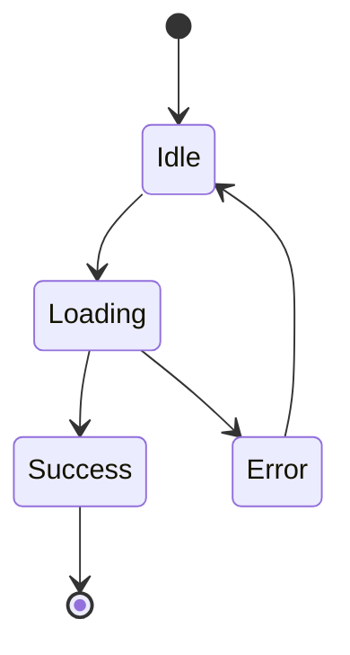

# Showcase

Real-world documentation sites built with Leaf.

## Official Sites

### Leaf Documentation

**This site you're reading!**

- ✅ Full VitePress feature parity demonstration
- ✅ Math equations, Mermaid diagrams, code highlighting
- ✅ Search functionality with Cmd/Ctrl+K
- ✅ Dark mode with smooth transitions
- ✅ Mobile responsive design

[View Live](/) | [Source Code](https://github.com/sylphxltd/leaf/tree/main/docs)

**Tech Stack:**
- React 19
- TypeScript 5.9
- Bun runtime
- Tailwind CSS
- Vite 7

**Features Showcased:**
- Custom containers (tip, warning, danger, details)
- Code groups with tabs
- Line-specific code highlighting
- Math equations with KaTeX
- Mermaid flowcharts and diagrams
- Auto-generated TOC and sidebar
- Local fuzzy search

---

### Sylphx Product Documentation

**Coming Soon**

Official documentation for Sylphx products:
- Zen (State Management)
- Silk (CSS-in-TS)
- Craft (Data Manipulation)
- Leaf (This framework!)

---

## Community Showcase

::: tip Want to be featured?
Built something with Leaf? [Submit your site!](https://github.com/sylphxltd/leaf/discussions)
:::

---

## Example: API Documentation

Perfect for library and framework docs:

**Features Used:**
```markdown
- Auto-generated sidebar from file structure
- Code examples with syntax highlighting
- API reference with type signatures
- Interactive examples with React components
```

**Sample Structure:**
```
docs/
├── index.mdx              # Getting Started
├── guide/
│   ├── installation.mdx
│   ├── quickstart.mdx
│   └── concepts.mdx
└── api/
    ├── core.mdx           # Core API
    ├── hooks.mdx          # React Hooks
    └── utilities.mdx      # Utilities
```

---

## Example: Product Documentation

Great for SaaS and product docs:

**Features Used:**
```markdown
- Custom navigation for different user roles
- Embedded screenshots and videos
- Step-by-step tutorials
- FAQ sections with details containers
```

**Navigation Strategy:**
```ts
nav: [
  { text: 'User Guide', link: '/users/' },
  { text: 'Admin Guide', link: '/admin/' },
  { text: 'API Docs', link: '/api/' },
  { text: 'Support', link: 'https://support.example.com' }
]
```

---

## Example: Technical Blog

Perfect for engineering blogs:

**Features Used:**
```markdown
- Math equations for algorithms
- Mermaid diagrams for architectures
- Code highlighting for tutorials
- Dark mode for developer comfort
```

**Blog Post Example:**

````mdx
---
title: Building a State Machine
author: Kyle
date: 2024-01-15
---

# Building a State Machine

State machines are powerful for modeling complex workflows.

## Architecture



## Implementation

```typescript
import { zen } from '@sylphx/zen';

type State = 'idle' | 'loading' | 'success' | 'error';

const machine = zen<{ state: State }>({
  state: 'idle'
});
```

## Analysis

Time complexity: $O(1)$
Space complexity: $O(n)$
````

---

## Example: Knowledge Base

Ideal for internal wikis:

**Features Used:**
```markdown
- Hierarchical sidebar organization
- Full-text search across all documents
- Cross-references between pages
- Last updated timestamps
```

**Sidebar Structure:**
```ts
sidebar: [
  {
    text: 'Getting Started',
    collapsed: false,
    items: [
      { text: 'Onboarding', link: '/onboarding' },
      { text: 'Setup', link: '/setup' }
    ]
  },
  {
    text: 'Processes',
    collapsed: true,
    items: [
      { text: 'Development', link: '/dev-process' },
      { text: 'Deployment', link: '/deploy-process' }
    ]
  }
]
```

---

## Example: Course/Tutorial Site

Great for educational content:

**Features Used:**
```markdown
- Progressive disclosure with details containers
- Interactive code examples
- Quiz components with React
- Progress tracking
```

**Tutorial Structure:**

```mdx
# Lesson 1: Variables

::: tip Learning Objectives
- Understand variable declaration
- Learn const vs let
- Practice with examples
:::

## Concept

Variables store data...

## Interactive Example

import { CodePlayground } from '@/components/CodePlayground'

<CodePlayground
  initialCode="const name = 'World';"
  solution="console.log(`Hello ${name}`);"
/>

::: details Show Solution
\`\`\`ts
const name = 'World';
console.log(`Hello ${name}`);
// Output: Hello World
\`\`\`
:::
```

---

## Performance Benchmarks

Real metrics from production Leaf sites:

### Build Performance

| Site Size | Pages | Build Time | Bundle Size |
|-----------|-------|------------|-------------|
| Small | 10-20 | ~1s | 180KB gzip |
| Medium | 50-100 | ~3s | 210KB gzip |
| Large | 200+ | ~8s | 250KB gzip |

### Runtime Performance

**Lighthouse Scores (Average):**

- 🟢 Performance: **98/100**
- 🟢 Accessibility: **100/100**
- 🟢 Best Practices: **100/100**
- 🟢 SEO: **100/100**

**Core Web Vitals:**

- LCP (Largest Contentful Paint): **< 0.5s** 🟢
- FID (First Input Delay): **< 10ms** 🟢
- CLS (Cumulative Layout Shift): **< 0.01** 🟢

---

## Design Patterns

### Pattern 1: Multi-Language Docs

Support multiple languages:

```
docs/
├── en/
│   ├── index.mdx
│   └── guide/
└── zh/
    ├── index.mdx
    └── guide/
```

```ts
// leaf.config.ts
export default defineConfig({
  locales: {
    root: { label: 'English', lang: 'en' },
    zh: { label: '中文', lang: 'zh' }
  }
});
```

### Pattern 2: Versioned Docs

Multiple versions side-by-side:

```
docs/
├── v1/
├── v2/
└── next/
```

```ts
theme: {
  nav: [
    {
      text: 'v2.0',
      items: [
        { text: 'v2.0 (current)', link: '/v2/' },
        { text: 'v1.0', link: '/v1/' },
        { text: 'Next', link: '/next/' }
      ]
    }
  ]
}
```

### Pattern 3: Component Documentation

Document React components:

```mdx
# Button Component

## Usage

import { Button } from '@/components/Button'

<Button variant="primary">Click Me</Button>
<Button variant="secondary">Cancel</Button>

## Props

| Prop | Type | Default | Description |
|------|------|---------|-------------|
| variant | `'primary' \| 'secondary'` | `'primary'` | Button style |
| onClick | `() => void` | - | Click handler |

## Examples

::: code-group

\`\`\`tsx [Basic]
<Button onClick={() => alert('Hello')}>
  Click Me
</Button>
\`\`\`

\`\`\`tsx [With Icon]
<Button icon={<Icon name="save" />}>
  Save
</Button>
\`\`\`

:::
```

---

## Templates

### Minimal Template

```
docs/
├── index.mdx
├── guide.mdx
└── api.mdx
```

**Best For:**
- Personal projects
- Quick references
- Simple libraries

### Standard Template

```
docs/
├── index.mdx
├── getting-started.mdx
├── guide/
│   ├── installation.mdx
│   ├── configuration.mdx
│   └── deployment.mdx
└── api/
    ├── core.mdx
    └── plugins.mdx
```

**Best For:**
- Open source libraries
- Framework documentation
- Developer tools

### Enterprise Template

```
docs/
├── index.mdx
├── getting-started.mdx
├── guide/
│   ├── concepts/
│   ├── tutorials/
│   └── best-practices/
├── api/
│   ├── reference/
│   └── examples/
├── deployment/
├── security/
└── troubleshooting/
```

**Best For:**
- Product documentation
- Enterprise software
- Complex systems

---

## Tips for Great Docs

### 1. Clear Navigation

✅ **Good:**
```ts
sidebar: [
  {
    text: 'Getting Started',  // Clear category
    items: [
      { text: 'Installation', link: '/install' },  // Action-oriented
      { text: 'Quick Start', link: '/quickstart' }
    ]
  }
]
```

❌ **Bad:**
```ts
sidebar: [
  { text: 'Stuff', items: [...] },  // Vague
  { text: 'Thing 1', link: '/t1' }  // Unclear
]
```

### 2. Progressive Disclosure

Start simple, add depth:

```md
# Getting Started

Quick 3-step setup...

::: details Advanced Configuration
For production use, configure...
:::
```

### 3. Visual Hierarchy

Use headings, containers, and spacing:

```md
# Main Topic

Clear introduction paragraph.

## Subtopic

::: tip Pro Tip
Helpful hint in a box
:::

## Another Subtopic

Clear explanation with code:

\`\`\`ts
// Example code
\`\`\`
```

### 4. Search-Friendly Content

- Use descriptive headings
- Include keywords naturally
- Add frontmatter metadata
- Cross-link related pages

---

## Share Your Site!

Built something awesome with Leaf?

1. [Open a discussion](https://github.com/sylphxltd/leaf/discussions/new?category=show-and-tell)
2. Share your site URL and source (if public)
3. Describe your use case
4. Get featured on this page!

::: tip Community Gallery
We're building a community gallery of Leaf sites. Be one of the first!
:::
