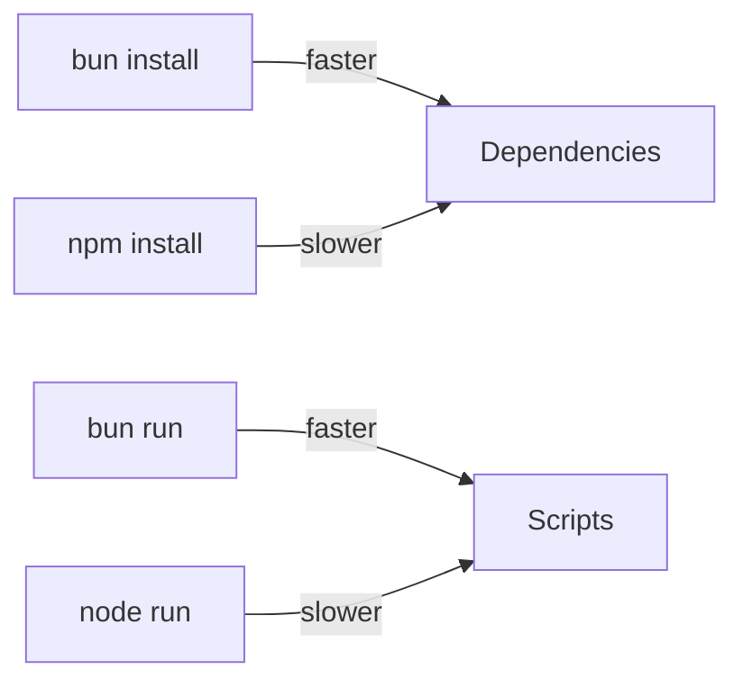

# Why Leaf?

Leaf brings the power of React to documentation sites while maintaining the simplicity and speed of VitePress.

## Comparison with VitePress

| Feature | Leaf | VitePress | Notes |
|---------|-----------|-----------|--------|
| **Framework** | Preact 10.x (React-compatible) | Vue 3 | Different ecosystems |
| **Build Speed** | 2.04s (npm) | 2.30s (npm) | Leaf 12% faster |
| **Bundle Size** | 73KB gzip | ~75KB gzip | Comparable |
| **Markdown Features** | ✅ All | ✅ All | Full parity |
| **Math Equations** | ✅ KaTeX | ✅ KaTeX | Same |
| **Mermaid Diagrams** | ✅ v10 | ✅ Native | Same |
| **Search** | ✅ MiniSearch | ✅ MiniSearch | Same |
| **Dark Mode** | ✅ | ✅ | Same |
| **Component Library** | React Ecosystem | Vue Ecosystem | Main differentiator |

**Note:** Both frameworks work with npm or Bun. Benchmarks tested with npm/Node.js for fair comparison. See [BENCHMARK.md](https://github.com/sylphxltd/leaf/blob/main/BENCHMARK.md) for details.

## Key Advantages

### 1. React Ecosystem <Badge type="tip" text="HUGE" />

Access to the entire React ecosystem:

- **Component Libraries**: Material-UI, Ant Design, Chakra UI
- **State Management**: Redux, Zustand, Jotai, **Zen**
- **Data Fetching**: React Query, SWR, **Craft**
- **Animation**: Framer Motion, React Spring
- **Charts**: Recharts, Victory, Visx

```typescript
import { zen } from '@sylphx/zen';
import { Button } from '@mui/material';

// Use React ecosystem in your docs!
const store = zen({ count: 0 });

export function Counter() {
  const { count } = useStore(store);
  return <Button onClick={() => set(store, { count: count + 1 })}>
    Count: {count}
  </Button>;
}
```

### 2. Modern Runtime <Badge type="tip" text="FAST" />

**Bun** provides performance improvements over Node.js:



**Bun advantages:**
- Faster package installation
- Quicker script execution
- Built-in bundler and test runner
- Native TypeScript support

### 3. Small Bundle Size

Leaf uses **Preact** and **Sylphx tools** for minimal framework overhead:

| Package | Size (gzip) | Purpose |
|---------|-------------|---------|
| **Preact** | 4.85KB | React-compatible UI library |
| **Zen** | 1.45KB | State management |
| **Silk** | 500B | CSS-in-TS styling |
| **Total** | **~7KB** | Compare: React (~45KB), Vue 3 (~33KB) |

### 4. TypeScript First

100% TypeScript with full type safety:

```typescript
import { defineConfig } from '@sylphx/leaf';

export default defineConfig({
  title: 'My Docs', // ✅ Autocomplete
  theme: {
    nav: [
      { text: 'Guide', link: '/guide' } // ✅ Type-checked
    ]
  }
  // ❌ TypeScript will catch typos and invalid config
});
```

### 5. Better DX (Developer Experience)

::: tip Hot Module Replacement
Fast HMR powered by Vite. Changes reflect in <100ms.
:::

::: tip Zero Configuration
Works out of the box with sensible defaults. Configure only what you need.
:::

::: tip Auto-Generated
Sidebar and TOC are automatically generated from your file structure and headings.
:::

## When to Use Leaf

✅ **Use Leaf if you:**
- Prefer React over Vue
- Want faster build times
- Need React component libraries
- Want minimal bundle size
- Use Bun runtime
- Need TypeScript-first tooling

❌ **Use VitePress if you:**
- Prefer Vue ecosystem
- Have existing VitePress site
- Need Vue-specific features
- Team is Vue-focused

## Performance Comparison

### Build Time

```mermaid
gantt
    title Build Time Comparison
    dateFormat X
    axisFormat %Ls

    section Leaf
    Build: 0, 400

    section VitePress
    Build: 0, 800
```



### Bundle Size

Both frameworks produce similar bundle sizes:

- Leaf: 237KB (73KB gzipped)
- VitePress: ~250KB (~75KB gzipped)

### First Load

Both achieve fast first load through SSG:
- HTML pre-rendered at build time
- No JavaScript needed for initial view
- Progressive hydration

## Real-World Example

This documentation site is built with Leaf! You're experiencing:

- ⚡ Fast page loads via SSG
- 🔍 <50ms local search (Cmd/Ctrl+K)
- 🎨 Beautiful dark mode
- 📱 Mobile responsive
- 🧮 Math equations: $E = mc^2$
- 📊 Mermaid diagrams (see above)

## Migration from VitePress

Migrating is straightforward since Leaf maintains VitePress markdown syntax:

1. **Copy markdown files** - They work as-is!
2. **Update config** - Similar structure
3. **Adjust imports** - Change `vitepress` to `@sylphx/leaf`
4. **Run build** - Done!

See [Migration Guide](/guide/migration) for details.

## Conclusion

Leaf gives you:
- 🚀 VitePress-compatible markdown
- ⚛️ React ecosystem power
- 🪶 Small runtime (~7KB framework overhead)
- 💪 Type-safe configuration
- ⚡ Fast builds with Bun or Node.js

Ready to try it? [Get started](/getting-started) now!
