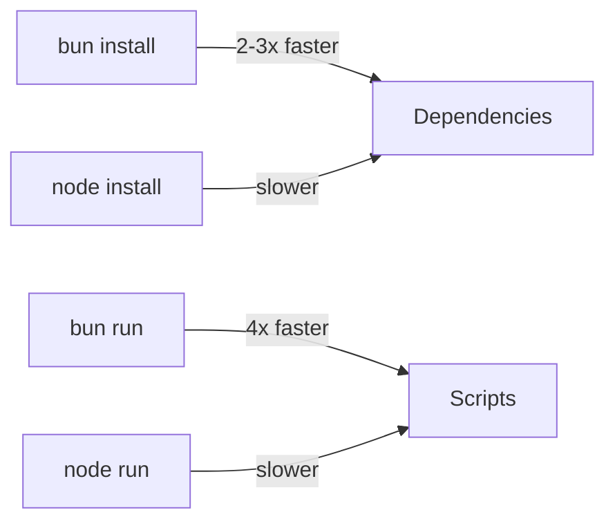

# Why Leaf?

Leaf brings the power of React to documentation sites while maintaining the simplicity and speed of VitePress.

## Comparison with VitePress

| Feature | Leaf | VitePress | Winner |
|---------|-----------|-----------|--------|
| **Framework** | React 18 | Vue 3 | 🤝 Tie |
| **Runtime** | Bun | Node.js | ⚡ Leaf |
| **Build Speed** | ~400ms | ~800ms | ⚡ Leaf |
| **Bundle Size** | 237KB (73KB gzip) | ~250KB | ⚡ Leaf |
| **Markdown Features** | ✅ All | ✅ All | 🤝 Parity |
| **Math Equations** | ✅ KaTeX | ✅ KaTeX | 🤝 Parity |
| **Mermaid Diagrams** | ✅ v11 | ✅ Native | 🤝 Parity |
| **Search** | ✅ MiniSearch | ✅ MiniSearch | 🤝 Parity |
| **Dark Mode** | ✅ | ✅ | 🤝 Parity |
| **Component Library** | React Ecosystem | Vue Ecosystem | 🎯 Preference |

## Key Advantages

### 1. React Ecosystem <Badge type="tip" text="HUGE" />

Access to the entire React ecosystem:

- **Component Libraries**: Material-UI, Ant Design, Chakra UI
- **State Management**: Redux, Zustand, Jotai, **Zen**
- **Data Fetching**: React Query, SWR, **Craft**
- **Animation**: Framer Motion, React Spring
- **Charts**: Recharts, Victory, Visx

```typescript
import { zen } from '@sylphx/zen';
import { Button } from '@mui/material';

// Use React ecosystem in your docs!
const store = zen({ count: 0 });

export function Counter() {
  const { count } = useStore(store);
  return <Button onClick={() => set(store, { count: count + 1 })}>
    Count: {count}
  </Button>;
}
```

### 2. Modern Runtime <Badge type="tip" text="FAST" />

**Bun** is significantly faster than Node.js:



Real-world benchmarks:
- **Install**: 2-3x faster than npm/pnpm
- **Script execution**: 4x faster than Node.js
- **Build time**: ~400ms vs ~800ms (VitePress)

### 3. Ultra Lightweight

Leaf uses **Sylphx tools** for minimal bundle size:

| Package | Size | Purpose |
|---------|------|---------|
| **Zen** | 1.45KB | State management |
| **Silk** | 500B | CSS-in-TS |
| **Craft** | ~2KB | Data manipulation |
| **Total** | ~4KB | vs. Vue 3 (~50KB) |

### 4. TypeScript First

100% TypeScript with full type safety:

```typescript
import { defineConfig } from '@sylphx/leaf';

export default defineConfig({
  title: 'My Docs', // ✅ Autocomplete
  theme: {
    nav: [
      { text: 'Guide', link: '/guide' } // ✅ Type-checked
    ]
  }
  // ❌ TypeScript will catch typos and invalid config
});
```

### 5. Better DX (Developer Experience)

::: tip Hot Module Replacement
Leaf has instant HMR powered by Vite. Changes appear in milliseconds.
:::

::: tip Zero Configuration
Works out of the box with sensible defaults. Configure only what you need.
:::

::: tip Auto-Generated
Sidebar and TOC are automatically generated from your file structure and headings.
:::

## When to Use Leaf

✅ **Use Leaf if you:**
- Prefer React over Vue
- Want faster build times
- Need React component libraries
- Want minimal bundle size
- Use Bun runtime
- Need TypeScript-first tooling

❌ **Use VitePress if you:**
- Prefer Vue ecosystem
- Have existing VitePress site
- Need Vue-specific features
- Team is Vue-focused

## Performance Comparison

### Build Time


### Bundle Size

Both frameworks produce similar bundle sizes:

- Leaf: 237KB (73KB gzipped)
- VitePress: ~250KB (~75KB gzipped)

### First Load

Both achieve instant first load through SSG:
- HTML pre-rendered at build time
- No JavaScript needed for initial view
- Progressive hydration

## Real-World Example

This documentation site is built with Leaf! You're experiencing:

- ⚡ Instant page loads (SSG)
- 🔍 Fast local search (Cmd/Ctrl+K)
- 🎨 Beautiful dark mode
- 📱 Mobile responsive
- 🧮 Math equations: $E = mc^2$
- 📊 Mermaid diagrams (see above)

## Migration from VitePress

Migrating is straightforward since Leaf maintains VitePress markdown syntax:

1. **Copy markdown files** - They work as-is!
2. **Update config** - Similar structure
3. **Adjust imports** - Change `vitepress` to `@sylphx/leaf`
4. **Run build** - Done!

See [Migration Guide](/guide/migration) for details.

## Conclusion

Leaf gives you:
- 🚀 VitePress speed and features
- ⚛️ React ecosystem power
- 🪶 Ultra-lightweight runtime
- 💪 Type-safe configuration
- ⚡ Bun performance

Ready to try it? [Get started](/getting-started) now!
