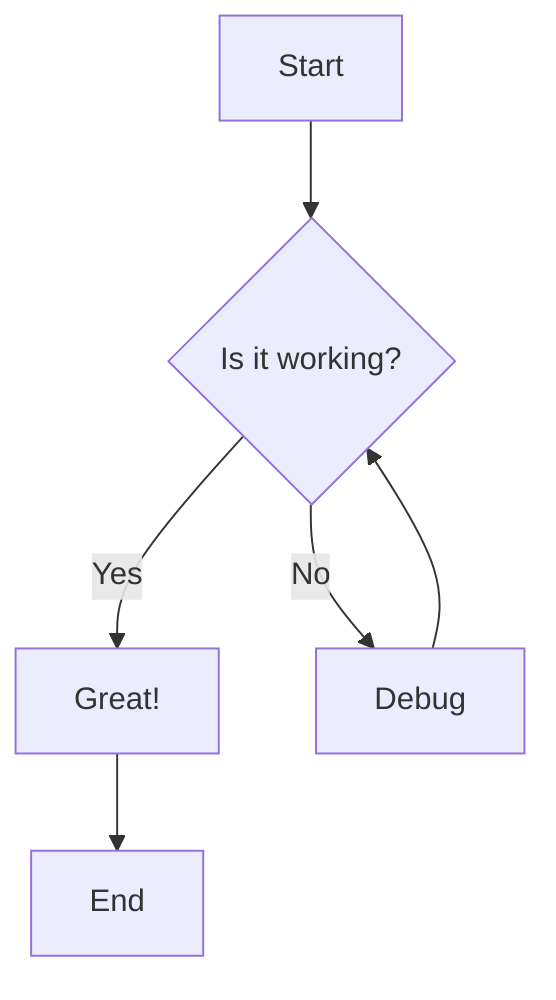
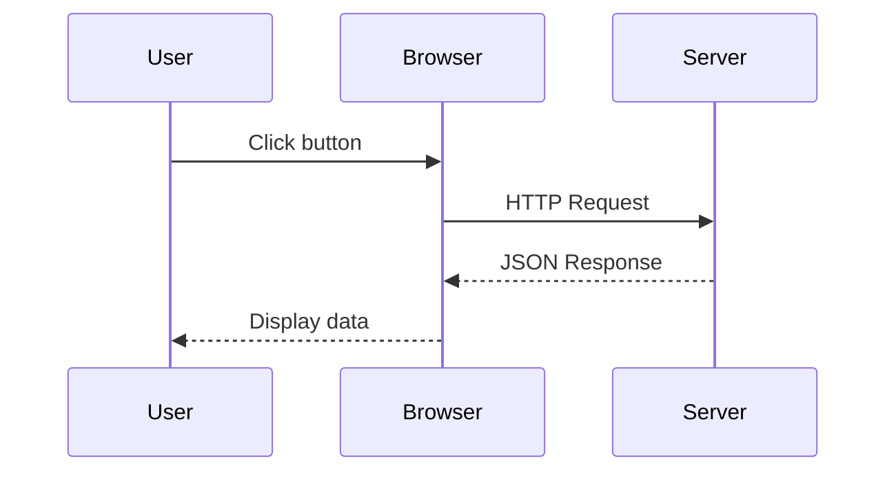
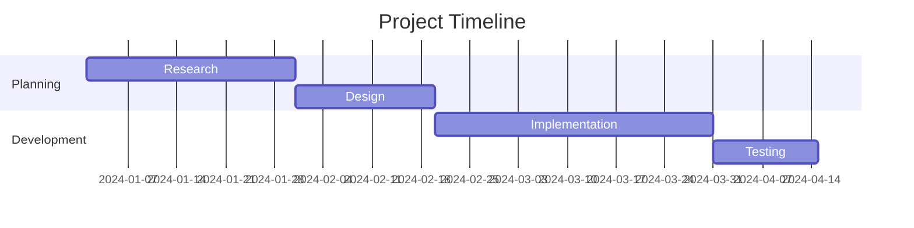

# Features & Examples

This page demonstrates all the powerful features available in ReactPress.

## Badges <Badge type="tip" text="NEW" />

Add inline badges to highlight important information:

- Feature <Badge type="tip" text="NEW" /> - Mark new features
- API <Badge type="warning" text="BETA" /> - Indicate beta status
- Method <Badge type="danger" text="DEPRECATED" /> - Show deprecations
- Version <Badge type="info" text="v2.0+" /> - Display version requirements

## Custom Containers

ReactPress supports VitePress-style custom containers for highlighting important information.

::: tip
This is a tip container. Use it for helpful suggestions and best practices.
:::

::: warning
This is a warning container. Use it to alert users about potential issues or important considerations.
:::

::: danger STOP
This is a danger container. Use it for critical warnings about breaking changes or destructive actions.
:::

::: details Click to expand
This is a details container. Use it for optional content that users can expand when needed.

You can put any markdown content inside:

- Lists
- **Bold text**
- `Code snippets`

```typescript
const example = "code blocks work too!";
```
:::

## Code Blocks with Copy Button

All code blocks automatically get a copy button on hover:

```typescript
import { zen } from '@sylphx/zen';

const store = zen({ count: 0 });

// Hover over this code block to see the copy button!
store.set({ count: store.get().count + 1 });
```

## Code Line Highlighting

Highlight specific lines in your code blocks using `{line-numbers}` syntax:

```typescript {2,4-6}
import { zen } from '@sylphx/zen';
const store = zen({ count: 0 }); // This line is highlighted

function increment() {
  store.set({ count: store.get().count + 1 }); // Lines 4-6 highlighted
  console.log('Count updated!');
}
```

## Code Groups

Display multiple code examples with tabs using code groups:

::: code-group

```js [config.js]
export default {
  title: 'My Site',
  description: 'My awesome site',
}
```

```ts [config.ts]
export default {
  title: 'My Site',
  description: 'My awesome site',
}
```

```json [config.json]
{
  "title": "My Site",
  "description": "My awesome site"
}
```

:::

```bash
# Install packages
bun add @sylphx/zen @sylphx/craft @sylphx/silk

# Run development server
bun run dev
```

## Table of Contents

Every page automatically generates a table of contents from your headings, displayed in the right sidebar.

## Auto-Generated Sidebar

The sidebar is automatically generated from your file structure. No manual configuration needed!

## External Link Icons

External links automatically get an icon and open in a new tab:

- [Vue.js Documentation](https://vuejs.org/guide/) - External link example
- [React Documentation](https://react.dev/) - Opens in new tab with icon
- Internal links like [Getting Started](/guide/) don't get icons

## Math Equations <Badge type="tip" text="NEW" />

Write beautiful math equations using LaTeX syntax powered by KaTeX.

**Inline math**: When $a \ne 0$, there are two solutions to $ax^2 + bx + c = 0$ and they are:

$$
x = \frac{-b \pm \sqrt{b^2 - 4ac}}{2a}
$$

**Block equations**: The famous Euler's identity:

$$
e^{i\pi} + 1 = 0
$$

**Complex formulas**: Maxwell's equations:

$$
\begin{aligned}
\nabla \cdot \mathbf{E} &= \frac{\rho}{\epsilon_0} \\
\nabla \cdot \mathbf{B} &= 0 \\
\nabla \times \mathbf{E} &= -\frac{\partial \mathbf{B}}{\partial t} \\
\nabla \times \mathbf{B} &= \mu_0\mathbf{J} + \mu_0\epsilon_0\frac{\partial \mathbf{E}}{\partial t}
\end{aligned}
$$

## Mermaid Diagrams <Badge type="tip" text="NEW" />

Create beautiful diagrams using Mermaid syntax:

**Flowchart**:



**Sequence Diagram**:



**Gantt Chart**:



## What's Next?

Check out the [Getting Started Guide](/guide/) to learn how to use these features in your own documentation.
